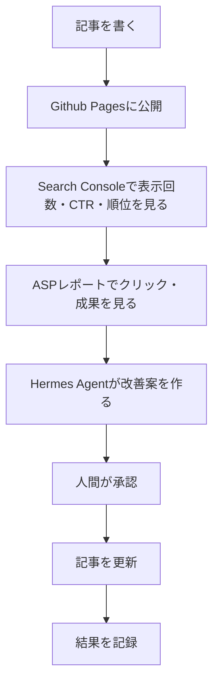

# 10. 無料版の自己改善ループ

## 改善の基本

## 改善判定

| 状態 | 判断 | 改善 |
|------|------|------|
| 表示回数あり・CTR低い | タイトルが弱い | タイトル変更 |
| CTRあり・滞在短い | 冒頭が弱い | 結論・体験談を先に出す |
| 読まれるが広告クリックなし | 導線が弱い | 比較表・CTA追加 |
| 広告クリックあり・成果なし | 商品が合っていない | 商品差し替え |
| 成果あり | 勝ち記事 | 関連記事を追加 |
| 表示なし | 需要不足かSEO不足 | キーワード見直し |
